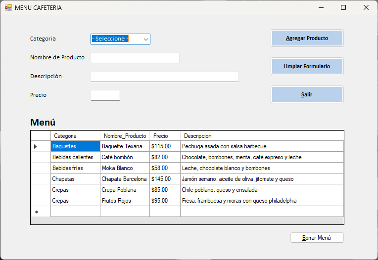
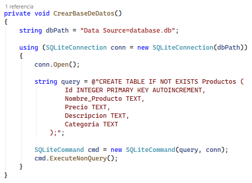

# MENU CAFETERIA

**Materia:** Estructura de Datos
**Profesora:** Ing. Paula Daniela Muñoz Zárate
**Fecha:** 25 de abril del 2026

## Descripción
Aplicación de escritorio desarrollada en C# (Visual Studio Community 2026) con Windows Forms que permite gestionar el inventario de una cafetería mediante una base de datos SQLite (local). Incluye funcionalidades para crear la base de datos (si no existe), agregar productos con validaciones (nombre, descripción, categoría y precio), formatear valores monetarios y visualizar registros en una tabla a través de un DataGrid. También permite limpiar formularios, reconstruir la tabla y manejar errores mediante mensajes al usuario. 

## Guía de Instalación

## Tecnologías Utilizadas
* C#
* Base de Datos: SQLite (Syste.Date.SQLite
* Visual Studio 2026
* .NET Framework, Version=v4.7.2

## Instalación y Configuración
1. Clona el repositorio: `git clone [URL del repo]`
2. Descarga la carpeta
3. Abre el archivo `.sln` en Visual Studio.
4. Agregar paquete Nuget System.Data.SQLite Core
5. Ir a Compilar > Administrador de configuración y asignar x64 como plataforma de soluciones activas.

## Demostración

1. Base de Datos.
   Si no existe la tabla Productos para almacenar los productos del menú, se crea en el mismo código mediante la función CrearBaseDeDatos.
   
   
3. 

## Integrantes
* Ederid Ramos Braulio - 333000028
